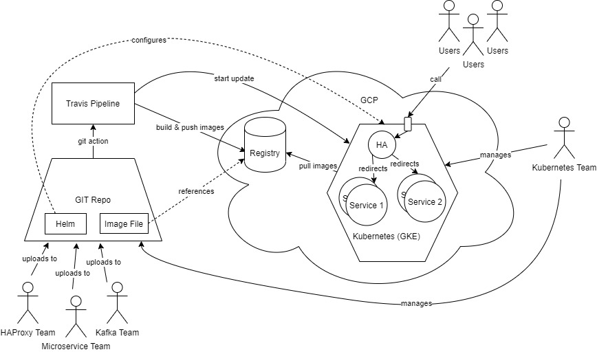
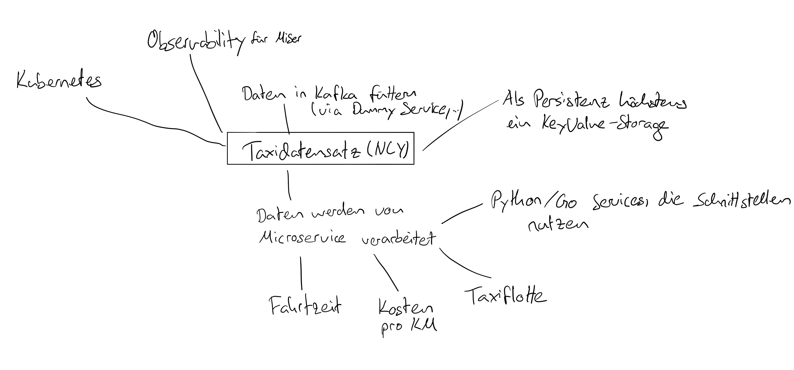

# Distributed Systems Demo 2020

## Subdomains & Endpoints:

**Grafana:** [https://grafana.cloud.elite-se.xyz](https://grafana.cloud.elite-se.xyz/)

**Prometheus:** [http://prometheus.cloud.elite-se.xyz:30967](http://prometheus.cloud.elite-se.xyz:30967/)

**Weavescope:** [http://weave-scope.cloud.elite-se.xyz:30967](http://weave-scope.cloud.elite-se.xyz:30967/)

**Taxi Dashboard:** [http://av.cloud.elite-se.xyz:30967/](http://av.cloud.elite-se.xyz:30967/)

**Taxi Analytics:** [http://maw-map.cloud.elite-se.xyz:30967/](http://maw-map.cloud.elite-se.xyz:30967/)

## Demo Use Case

[New York City Taxi Dataset](https://www1.nyc.gov/site/tlc/about/tlc-trip-record-data.page)

**Basic idea**: 
- The cloud team hosts a small Kubernetes Cluster (hosted by Google Cloud) with basic monitoring services
- Microservices and other services can be deployed in the cluster (using configuration files)
- The participating teams exchange data to make the demonstration more interesting

**The Relationships in Detail**:

## Teams

- Cloud Technologien in Practice
- Microservice Architectures in Practice
- Kafka
- GoLang
- HAProxy

## Setup

### Build docker containers

1. taxi-trip-converter: `docker build -f taxi-trip-converter/Dockerfile -t taxi-trip-converter .`
2. taxi-trip-metrics: `docker build -f taxi-trip-metrics/Dockerfile -t taxi-trip-metrics .`
3. taxi-trip-consumer: `docker build -f taxi-trip-consumer/Dockerfile -t taxi-trip-consumer .`
4. taxi-trip-aggregated-visualisations: `docker build -f taxi-trip-aggregated-visualisations/Dockerfile -t aggregated-visualisations .`

### Start docker containers

1. taxi-trip-converter: `docker run --name taxi-trip-converter taxi-trip-converter .`
2. taxi-trip-metrics: `docker run --name taxi-trip-metrics taxi-trip-metrics .`
3. taxi-trip-consumer: `docker run --name taxi-trip-consumer taxi-trip-consumer .`

### Kubernetes

#### 1. Setting up a cluster

There are several ways to get a running Kubernetes cluster. The hard way is deploying it yourself on virtual machines. I would recommend using a cloud provider like AWS, Azure or Google Cloud Platform (GCP). We used GCP with the 300$ free trial for this demo.

The file `resources.tf` is a [Terraform](https://www.terraform.io/downloads.html) file. You need to install terraform locally and provide it with credentials from GCP. Variables like `project_name` needs to be adjusted. To deploy you can run `terraform apply`. Deploying a cluster on GCP can take up to 15mins.

The `resources.tf` deploys three resources:

- A docker container registry which can be used by Kubernetes to pull images
- The kubernetes Cluster
- The node pool for the kubernetes cluster (basically the VMs, where the stuff runs on)

#### 2. Setup your dev environment

You need: 

- kubectl CLI (i recommend installing the kubectl auto completions for zsh or bash -> makes your life a lot easier)
- Google Cloud (gcloud) CLI
- [helm](https://helm.sh/docs/intro/install/)

You need to login with the gcloud cli. Kubectl credentials can be setup using gcloud commands.

#### 3. Set firewall rules

To access the nodes via NodePorts in the cluster you need to allow the following ports for all VMs (can be more restrictive as well if you want to):

Protocols and ports:

- tcp:30967
- tcp:31040
- tcp:32448
- tcp:31090
- tcp:31091 

#### 4. Deploy the services

Some preparations: Build all docker images and push them to the docker registry we created earlier. Also run the `setup_helm_repos.sh` script.

All services have `install.sh` scripts. Some also have `delete.sh` scripts. The install scripts are idempotent and Kubernetes tries to apply your changes without restarting pods.

## Useful Commands

- `kubectl get pods` shows all running pods. `kubectl get pods --all-namespaces` shows all pods, even those from the Kubernetes internal systems. `kubectl get pods -o wide` shows more information about the running pods (for example on which node they're running on)
- `kubectl get nodes` shows all nodes (=VMs)
- `kubectl describe <...>`
  - `pod <pod-name>` shows the configuration of a pod. Also shows error information in case a pod crashed etc.
  - `node <node-name>` show what's running on a node and shows used resources
- `kubectl top <...>` shows resource usage of pods, nodes etc.
- `kubectl delete pod <pod-name>` deletes a pod which then gets rebuild (can be used to restart stuff)
- `kubectl logs <pod-name> [-c <container-name>] [--follow] [--previous] ` shows current logs for a pod (-c must be specified if more than one container runs in a pod). --previous shows logs of the previous running pod if it was restarted (This only works if the container was restarted by Kubernetes, see `kubectl get pods` for that. If you deleted the pod via `kubectl delete pod` then the logs are lost)
- `kubectl exec -it <pod-name> [-c <container-name>] /bin/sh` runs a shell in a running container. /bin/sh can be sometimes replaced by /bin/bash if the container has bash installed. Using this method you can kill processes in the container triggering a restart of the pod (this is dirty though).